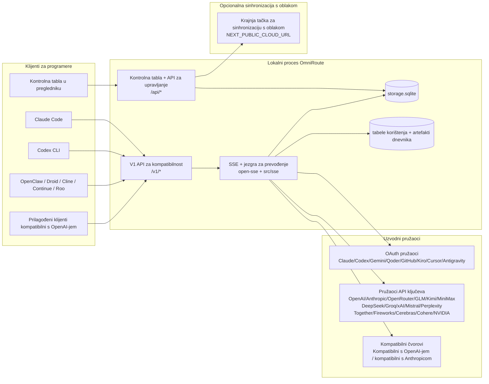
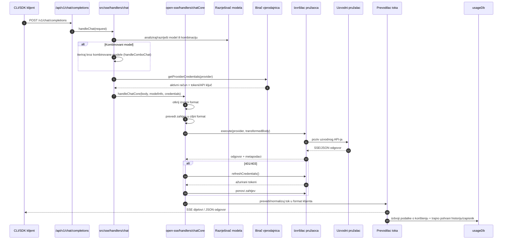
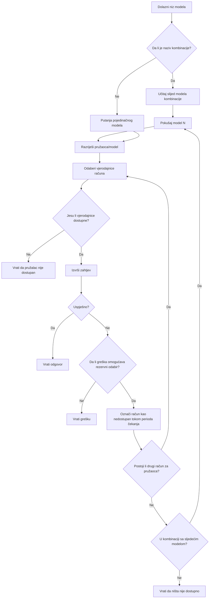
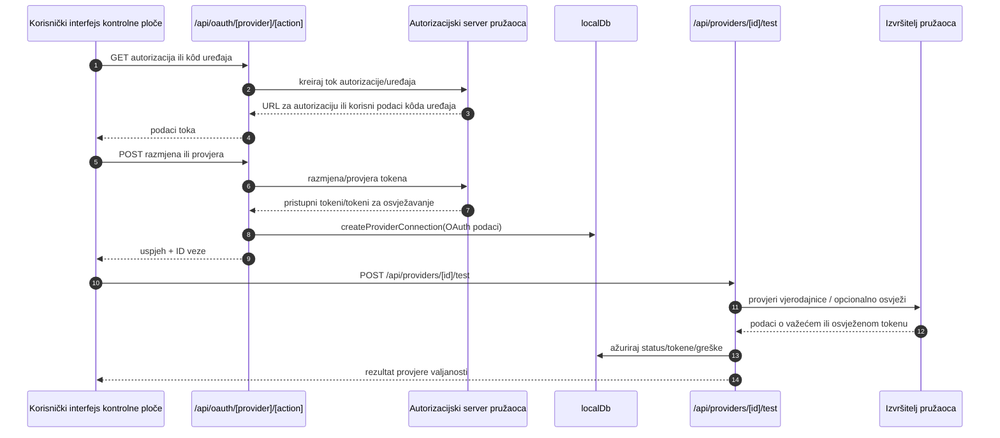
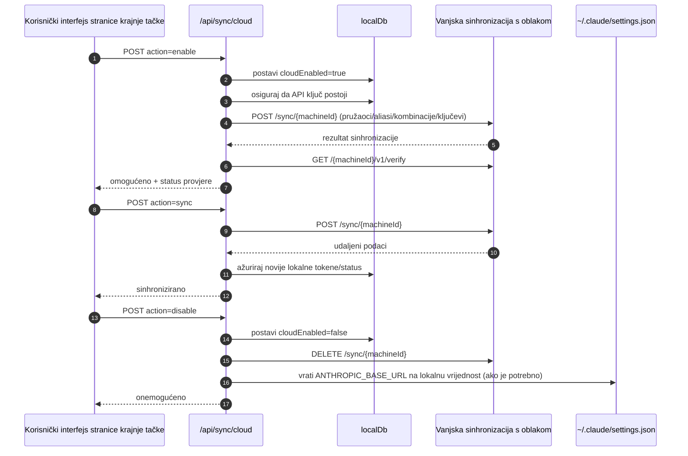
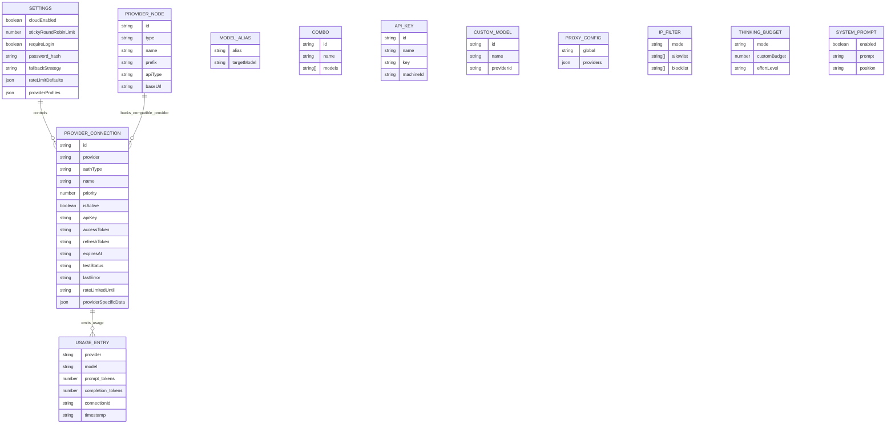
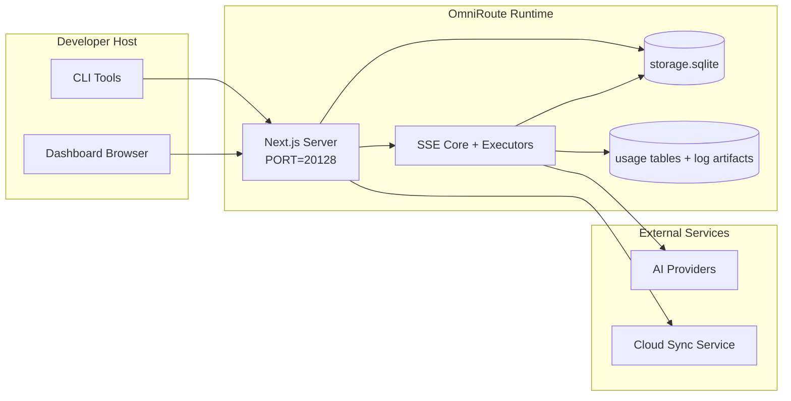

# OmniRoute Architecture (Bosanski)

🌐 **Languages:** 🇺🇸 [English](../../../../architecture/ARCHITECTURE.md) · 🇪🇹 [am](../../../am/docs/architecture/ARCHITECTURE.md) · 🇸🇦 [ar](../../../ar/docs/architecture/ARCHITECTURE.md) · 🇦🇿 [az](../../../az/docs/architecture/ARCHITECTURE.md) · 🇧🇬 [bg](../../../bg/docs/architecture/ARCHITECTURE.md) · 🇧🇩 [bn](../../../bn/docs/architecture/ARCHITECTURE.md) · 🇨🇿 [cs](../../../cs/docs/architecture/ARCHITECTURE.md) · 🇩🇰 [da](../../../da/docs/architecture/ARCHITECTURE.md) · 🇩🇪 [de](../../../de/docs/architecture/ARCHITECTURE.md) · 🇬🇷 [el](../../../el/docs/architecture/ARCHITECTURE.md) · 🇪🇸 [es](../../../es/docs/architecture/ARCHITECTURE.md) · 🇪🇪 [et](../../../et/docs/architecture/ARCHITECTURE.md) · 🇮🇷 [fa](../../../fa/docs/architecture/ARCHITECTURE.md) · 🇫🇮 [fi](../../../fi/docs/architecture/ARCHITECTURE.md) · 🇫🇷 [fr](../../../fr/docs/architecture/ARCHITECTURE.md) · 🇮🇪 [ga](../../../ga/docs/architecture/ARCHITECTURE.md) · 🇮🇳 [gu](../../../gu/docs/architecture/ARCHITECTURE.md) · 🇳🇬 [ha](../../../ha/docs/architecture/ARCHITECTURE.md) · 🇮🇱 [he](../../../he/docs/architecture/ARCHITECTURE.md) · 🇮🇳 [hi](../../../hi/docs/architecture/ARCHITECTURE.md) · 🇭🇷 [hr](../../../hr/docs/architecture/ARCHITECTURE.md) · 🇭🇺 [hu](../../../hu/docs/architecture/ARCHITECTURE.md) · 🇦🇲 [hy](../../../hy/docs/architecture/ARCHITECTURE.md) · 🇮🇩 [id](../../../id/docs/architecture/ARCHITECTURE.md) · 🇳🇬 [ig](../../../ig/docs/architecture/ARCHITECTURE.md) · 🇮🇹 [it](../../../it/docs/architecture/ARCHITECTURE.md) · 🇯🇵 [ja](../../../ja/docs/architecture/ARCHITECTURE.md) · 🇬🇪 [ka](../../../ka/docs/architecture/ARCHITECTURE.md) · 🇰🇭 [km](../../../km/docs/architecture/ARCHITECTURE.md) · 🇮🇳 [kn](../../../kn/docs/architecture/ARCHITECTURE.md) · 🇰🇷 [ko](../../../ko/docs/architecture/ARCHITECTURE.md) · 🇱🇹 [lt](../../../lt/docs/architecture/ARCHITECTURE.md) · 🇱🇻 [lv](../../../lv/docs/architecture/ARCHITECTURE.md) · 🇮🇳 [ml](../../../ml/docs/architecture/ARCHITECTURE.md) · 🇮🇳 [mr](../../../mr/docs/architecture/ARCHITECTURE.md) · 🇲🇾 [ms](../../../ms/docs/architecture/ARCHITECTURE.md) · 🇲🇹 [mt](../../../mt/docs/architecture/ARCHITECTURE.md) · 🇲🇲 [my](../../../my/docs/architecture/ARCHITECTURE.md) · 🇳🇵 [ne](../../../ne/docs/architecture/ARCHITECTURE.md) · 🇳🇱 [nl](../../../nl/docs/architecture/ARCHITECTURE.md) · 🇳🇴 [no](../../../no/docs/architecture/ARCHITECTURE.md) · 🇮🇳 [or](../../../or/docs/architecture/ARCHITECTURE.md) · 🇮🇳 [pa](../../../pa/docs/architecture/ARCHITECTURE.md) · 🇵🇭 [phi](../../../phi/docs/architecture/ARCHITECTURE.md) · 🇵🇱 [pl](../../../pl/docs/architecture/ARCHITECTURE.md) · 🇵🇹 [pt](../../../pt/docs/architecture/ARCHITECTURE.md) · 🇧🇷 [pt-BR](../../../pt-BR/docs/architecture/ARCHITECTURE.md) · 🇷🇴 [ro](../../../ro/docs/architecture/ARCHITECTURE.md) · 🇷🇺 [ru](../../../ru/docs/architecture/ARCHITECTURE.md) · 🇱🇰 [si](../../../si/docs/architecture/ARCHITECTURE.md) · 🇸🇰 [sk](../../../sk/docs/architecture/ARCHITECTURE.md) · 🇸🇮 [sl](../../../sl/docs/architecture/ARCHITECTURE.md) · 🇷🇸 [sr](../../../sr/docs/architecture/ARCHITECTURE.md) · 🇸🇪 [sv](../../../sv/docs/architecture/ARCHITECTURE.md) · 🇰🇪 [sw](../../../sw/docs/architecture/ARCHITECTURE.md) · 🇮🇳 [ta](../../../ta/docs/architecture/ARCHITECTURE.md) · 🇮🇳 [te](../../../te/docs/architecture/ARCHITECTURE.md) · 🇹🇭 [th](../../../th/docs/architecture/ARCHITECTURE.md) · 🇹🇷 [tr](../../../tr/docs/architecture/ARCHITECTURE.md) · 🇺🇦 [uk-UA](../../../uk-UA/docs/architecture/ARCHITECTURE.md) · 🇵🇰 [ur](../../../ur/docs/architecture/ARCHITECTURE.md) · 🇺🇿 [uz](../../../uz/docs/architecture/ARCHITECTURE.md) · 🇻🇳 [vi](../../../vi/docs/architecture/ARCHITECTURE.md) · 🇳🇬 [yo](../../../yo/docs/architecture/ARCHITECTURE.md) · 🇨🇳 [zh-CN](../../../zh-CN/docs/architecture/ARCHITECTURE.md) · 🇹🇼 [zh-TW](../../../zh-TW/docs/architecture/ARCHITECTURE.md)

---

🌐 **Jezici:** 🇺🇸 [English](./ARCHITECTURE.md) | 🇪🇹 [አማርኛ](../i18n/am/docs/architecture/ARCHITECTURE.md) | 🇸🇦 [العربية](../i18n/ar/docs/architecture/ARCHITECTURE.md) | 🇦🇿 [Azərbaycan dili](../i18n/az/docs/architecture/ARCHITECTURE.md) | 🇧🇬 [Български](../i18n/bg/docs/architecture/ARCHITECTURE.md) | 🇧🇩 [বাংলা](../i18n/bn/docs/architecture/ARCHITECTURE.md) | 🇧🇦 [Bosanski](../i18n/bs/docs/architecture/ARCHITECTURE.md) | 🇨🇿 [Čeština](../i18n/cs/docs/architecture/ARCHITECTURE.md) | 🇩🇰 [Dansk](../i18n/da/docs/architecture/ARCHITECTURE.md) | 🇩🇪 [Deutsch](../i18n/de/docs/architecture/ARCHITECTURE.md) | 🇬🇷 [Ελληνικά](../i18n/el/docs/architecture/ARCHITECTURE.md) | 🇪🇸 [Español](../i18n/es/docs/architecture/ARCHITECTURE.md) | 🇪🇪 [Eesti](../i18n/et/docs/architecture/ARCHITECTURE.md) | 🇮🇷 [فارسی](../i18n/fa/docs/architecture/ARCHITECTURE.md) | 🇫🇮 [Suomi](../i18n/fi/docs/architecture/ARCHITECTURE.md) | 🇫🇷 [Français](../i18n/fr/docs/architecture/ARCHITECTURE.md) | 🇮🇪 [Gaeilge](../i18n/ga/docs/architecture/ARCHITECTURE.md) | 🇮🇳 [ગુજરાતી](../i18n/gu/docs/architecture/ARCHITECTURE.md) | 🇳🇬 [Hausa](../i18n/ha/docs/architecture/ARCHITECTURE.md) | 🇮🇱 [עברית](../i18n/he/docs/architecture/ARCHITECTURE.md) | 🇮🇳 [हिन्दी](../i18n/hi/docs/architecture/ARCHITECTURE.md) | 🇭🇷 [Hrvatski](../i18n/hr/docs/architecture/ARCHITECTURE.md) | 🇭🇺 [Magyar](../i18n/hu/docs/architecture/ARCHITECTURE.md) | 🇦🇲 [Հայերեն](../i18n/hy/docs/architecture/ARCHITECTURE.md) | 🇮🇩 [Bahasa Indonesia](../i18n/id/docs/architecture/ARCHITECTURE.md) | 🇳🇬 [Igbo](../i18n/ig/docs/architecture/ARCHITECTURE.md) | 🇮🇹 [Italiano](../i18n/it/docs/architecture/ARCHITECTURE.md) | 🇯🇵 [日本語](../i18n/ja/docs/architecture/ARCHITECTURE.md) | 🇬🇪 [ქართული](../i18n/ka/docs/architecture/ARCHITECTURE.md) | 🇰🇭 [ខ្មែរ](../i18n/km/docs/architecture/ARCHITECTURE.md) | 🇮🇳 [ಕನ್ನಡ](../i18n/kn/docs/architecture/ARCHITECTURE.md) | 🇰🇷 [한국어](../i18n/ko/docs/architecture/ARCHITECTURE.md) | 🇱🇹 [Lietuvių](../i18n/lt/docs/architecture/ARCHITECTURE.md) | 🇱🇻 [Latviešu](../i18n/lv/docs/architecture/ARCHITECTURE.md) | 🇮🇳 [മലയാളം](../i18n/ml/docs/architecture/ARCHITECTURE.md) | 🇮🇳 [मराठी](../i18n/mr/docs/architecture/ARCHITECTURE.md) | 🇲🇾 [Bahasa Melayu](../i18n/ms/docs/architecture/ARCHITECTURE.md) | 🇲🇹 [Malti](../i18n/mt/docs/architecture/ARCHITECTURE.md) | 🇲🇲 [မြန်မာ](../i18n/my/docs/architecture/ARCHITECTURE.md) | 🇳🇵 [नेपाली](../i18n/ne/docs/architecture/ARCHITECTURE.md) | 🇳🇱 [Nederlands](../i18n/nl/docs/architecture/ARCHITECTURE.md) | 🇳🇴 [Norsk](../i18n/no/docs/architecture/ARCHITECTURE.md) | 🇮🇳 [ଓଡ଼ିଆ](../i18n/or/docs/architecture/ARCHITECTURE.md) | 🇮🇳 [ਪੰਜਾਬੀ](../i18n/pa/docs/architecture/ARCHITECTURE.md) | 🇵🇭 [Filipino](../i18n/phi/docs/architecture/ARCHITECTURE.md) | 🇵🇱 [Polski](../i18n/pl/docs/architecture/ARCHITECTURE.md) | 🇵🇹 [Português (Portugal)](../i18n/pt/docs/architecture/ARCHITECTURE.md) | 🇧🇷 [Português (Brasil)](../i18n/pt-BR/docs/architecture/ARCHITECTURE.md) | 🇷🇴 [Română](../i18n/ro/docs/architecture/ARCHITECTURE.md) | 🇷🇺 [Русский](../i18n/ru/docs/architecture/ARCHITECTURE.md) | 🇱🇰 [සිංහල](../i18n/si/docs/architecture/ARCHITECTURE.md) | 🇸🇰 [Slovenčina](../i18n/sk/docs/architecture/ARCHITECTURE.md) | 🇸🇮 [Slovenščina](../i18n/sl/docs/architecture/ARCHITECTURE.md) | 🇷🇸 [Српски](../i18n/sr/docs/architecture/ARCHITECTURE.md) | 🇸🇪 [Svenska](../i18n/sv/docs/architecture/ARCHITECTURE.md) | 🇰🇪 [Kiswahili](../i18n/sw/docs/architecture/ARCHITECTURE.md) | 🇮🇳 [தமிழ்](../i18n/ta/docs/architecture/ARCHITECTURE.md) | 🇮🇳 [తెలుగు](../i18n/te/docs/architecture/ARCHITECTURE.md) | 🇹🇭 [ไทย](../i18n/th/docs/architecture/ARCHITECTURE.md) | 🇹🇷 [Türkçe](../i18n/tr/docs/architecture/ARCHITECTURE.md) | 🇺🇦 [Українська](../i18n/uk-UA/docs/architecture/ARCHITECTURE.md) | 🇵🇰 [اردو](../i18n/ur/docs/architecture/ARCHITECTURE.md) | 🇺🇿 [Oʻzbekcha](../i18n/uz/docs/architecture/ARCHITECTURE.md) | 🇻🇳 [Tiếng Việt](../i18n/vi/docs/architecture/ARCHITECTURE.md) | 🇳🇬 [Yorùbá](../i18n/yo/docs/architecture/ARCHITECTURE.md) | 🇨🇳 [中文 (简体)](../i18n/zh-CN/docs/architecture/ARCHITECTURE.md) | 🇹🇼 [中文 (繁體)](../i18n/zh-TW/docs/architecture/ARCHITECTURE.md)

_Posljednje ažuriranje: 2026-06-28_

## Izvršni sažetak

OmniRoute je lokalni pristupnik za AI usmjeravanje i nadzorna ploča izgrađena na Next.js-u.
Pruža jedinstvenu krajnju tačku kompatibilnu s OpenAI-jem (`/v1/*`) i usmjerava saobraćaj između više uzvodnih pružalaca usluga uz prevođenje, rezervne opcije, osvježavanje tokena i praćenje korištenja.

Ključne mogućnosti:

- API interfejs kompatibilan s OpenAI-jem za CLI/alate (355 pružalaca usluga, 108 izvršilaca)
- Prevođenje zahtjeva/odgovora između formata pružalaca usluga
- Rezervni slijed kombinacije modela (sekvenca više modela)
- Strukturirani koraci kombinacije (`provider + model + connection`) s redoslijedom tokom izvođenja prema `compositeTiers`
- Rezervni slijed na nivou računa (više računa po pružaocu usluga)
- Prethodna provjera kvote i P2C odabir računa koji uzima u obzir kvotu u glavnoj putanji za razgovor
- Upravljanje vezama s pružaocima usluga putem OAuth-a i API ključeva (22 modula OAuth pružalaca usluga)
- Generisanje ugradnji putem `/v1/embeddings` (18 pružalaca usluga)
- Generisanje slika putem `/v1/images/generations` (10+ pružalaca usluga, 20+ modela)
- Transkripcija zvuka putem `/v1/audio/transcriptions` (18 pružalaca usluga)
- Pretvaranje teksta u govor putem `/v1/audio/speech` (24 ugrađena pružaoca usluga)
- Generisanje videa putem `/v1/videos/generations` (ComfyUI + SD WebUI)
- Generisanje muzike putem `/v1/music/generations` (ComfyUI)
- Web-pretraživanje putem `/v1/search` (20 pružalaca usluga)
- Moderiranje putem `/v1/moderations`
- Ponovno rangiranje putem `/v1/rerank`
- Raščlanjivanje oznaka za razmišljanje (``) za modele zaključivanja
- Sanitizacija odgovora radi stroge kompatibilnosti s OpenAI SDK-om
- Normalizacija uloga (developer→system, system→user) radi kompatibilnosti između pružalaca usluga
- Pretvaranje strukturiranog izlaza (json_schema → Gemini responseSchema)
- Lokalna trajna pohrana pružalaca usluga, ključeva, pseudonima, kombinacija, postavki i cijena (122 DB modula)
- Praćenje korištenja/troškova i evidentiranje zahtjeva
- Opcionalna sinhronizacija s oblakom za sinhronizaciju stanja između više uređaja
- Lista dozvoljenih/blokiranih IP adresa za kontrolu pristupa API-ju
- Upravljanje budžetom za razmišljanje (direktno prosljeđivanje/automatski/prilagođeni/adaptivni)
- Globalno umetanje sistemskog upita
- Praćenje sesija i izrada otisaka
- Poboljšano ograničavanje brzine po računu s profilima specifičnim za pružaoce usluga
- Obrazac prekidača strujnog kola za otpornost pružalaca usluga
- Zaštita od stampeda zahtjeva pomoću zaključavanja mutexom
- Keš za deduplikaciju zahtjeva zasnovan na potpisima
- Domenski sloj: pravila troškova, politika rezervnih opcija, politika zaključavanja
- Context Relay: sažeci primopredaje sesije radi kontinuiteta pri rotaciji računa
- Trajna pohrana stanja domene (SQLite keš s neposrednim upisom za rezervne opcije, budžete, zaključavanja i prekidače strujnog kola)
- Mehanizam politika za centraliziranu procjenu zahtjeva (zaključavanje → budžet → rezervna opcija)
- Telemetrija zahtjeva s agregacijom latencije p50/p95/p99
- Telemetrija odredišta kombinacije i historijsko stanje odredišta kombinacije putem `combo_execution_key` / `combo_step_id`
- ID korelacije (X-Request-Id) za praćenje od početka do kraja
- Evidentiranje revizije usklađenosti uz mogućnost isključivanja po API ključu
- Okvir za evaluaciju radi osiguranja kvaliteta LLM-a
- Nadzorna ploča stanja sa statusom prekidača strujnog kola pružalaca usluga u stvarnom vremenu
- MCP server (110 alata) s 3 transporta (stdio/SSE/Streamable HTTP)
- A2A server (JSON-RPC 2.0 + SSE) s vještinama i životnim ciklusom zadataka
- Sistem memorije (izdvajanje, umetanje, dohvaćanje, sažimanje)
- Sistem vještina (registar, izvršilac, izolirano okruženje, ugrađene vještine)
- MITM proxy s upravljanjem certifikatima i DNS-om
- Posrednički softver za zaštitu od ubacivanja upita
- Cjevovod za kompresiju upita s Cavemanom, RTK-om, naslaganim cjevovodima, kombinacijama kompresije, jezičkim paketima i analitikom
- ACP (Agent Communication Protocol) registar
- Modularni OAuth pružaoci usluga (22 pojedinačna modula u `src/lib/oauth/providers/`)
- Skripte za deinstalaciju/potpunu deinstalaciju
- Radnja popravke OAuth okruženja
- WebSocket most za WS klijente kompatibilne s OpenAI-jem (`/v1/ws`)
- Upravljanje tokenima za sinhronizaciju (izdavanje/opoziv, preuzimanje konfiguracijskog paketa verzioniranog ETag-om)
- GLM Thinking (`glmt`) kao punopravna unaprijed definirana postavka pružaoca usluga
- Hibridno brojanje tokena (`/messages/count_tokens` na strani pružaoca usluga uz procjenu kao rezervnu opciju)
- Automatsko početno popunjavanje pseudonima modela (30+ normalizacija dijalekata između proxyja pri pokretanju)
- Sigurno odlazno dohvaćanje sa SSRF zaštitom, blokiranjem privatnih URL-ova i podesivim ponovnim pokušajima
- Ponovni pokušaji razgovora koji uzimaju u obzir period čekanja, s podesivim `requestRetry` i `maxRetryIntervalSec`
- Validacija izvršnog okruženja pomoću Zoda pri pokretanju
- Revizija usklađenosti v2 sa straničenjem, CRUD događajima pružalaca usluga i evidentiranjem validacije blokirane SSRF-om

Primarni model izvođenja:

- Next.js rute aplikacije u `src/app/api/*` implementiraju API-je nadzorne ploče i API-je za kompatibilnost
- Zajednička jezgra za SSE/usmjeravanje u `src/sse/*` + `open-sse/*` upravlja izvršavanjem pružalaca usluga, prevođenjem, prijenosom podataka, rezervnim opcijama i korištenjem

## Referentni dijagrami

Kanonski Mermaid izvori pod kontrolom verzija za platformu v3.8.0 nalaze se u
[`docs/diagrams/`](../diagrams/README.md). Dva su prikazana u nastavku radi orijentacije;
ostali su povezani iz vodiča specifičnih za njihove domene.


> Izvor: [diagrams/request-pipeline.mmd](../diagrams/request-pipeline.mmd)


> Izvor: [diagrams/resilience-3layers.mmd](../diagrams/resilience-3layers.mmd) — također je povezan iz
> [RESILIENCE_GUIDE.md](./RESILIENCE_GUIDE.md) i reference za otpornost u `CLAUDE.md`.

## Opseg i granice

### U opsegu

- Lokalno izvršno okruženje pristupnika
- API-ji za upravljanje kontrolnom pločom
- Autentifikacija pružalaca usluga i osvježavanje tokena
- Prevođenje zahtjeva i SSE strujanje
- Lokalno stanje + trajno pohranjivanje podataka o korištenju
- Opcionalna orkestracija sinhronizacije s oblakom

### Izvan opsega

- Implementacija usluge u oblaku iza `NEXT_PUBLIC_CLOUD_URL`
- SLA/kontrolna ravan pružaoca usluga izvan lokalnog procesa
- Sami vanjski CLI izvršni programi (Claude CLI, Codex CLI itd.)

## Površina kontrolne ploče (trenutno)

Glavne stranice u `src/app/(dashboard)/dashboard/`:

- `/dashboard` — brzi početak + pregled pružalaca usluga
- `/dashboard/endpoint` — proxy krajnje tačke + kartice za MCP + A2A + API krajnje tačke
- `/dashboard/providers` — veze i vjerodajnice pružalaca usluga
- `/dashboard/combos` — kombinovane strategije, predlošci, alat za izgradnju zasnovan na koracima, pravila usmjeravanja modela, ručni trajno pohranjeni redoslijed
- `/dashboard/auto-combo` — mehanizam automatskog kombinovanja: težine bodovanja, paketi načina rada, unaprijed postavljene vrijednosti virtuelne fabrike, telemetrija
- `/dashboard/costs` — objedinjavanje troškova i pregled cijena
- `/dashboard/analytics` — analitika korištenja, evaluacije, stanje odredišta kombinacija
- `/dashboard/limits` — kontrole kvota/ograničenja brzine
- `/dashboard/cli-tools` — uvođenje u CLI, otkrivanje izvršnog okruženja, generisanje konfiguracije
- `/dashboard/agents` — otkriveni ACP agenti + registracija prilagođenih agenata
- `/dashboard/cloud-agents` — zadaci agenata smještenih u oblaku (Codex Cloud, Devin, Jules) i životni ciklus zadataka
- `/dashboard/skills` — registar A2A vještina, izvršavanje u izoliranom okruženju, ugrađeni katalog vještina
- `/dashboard/memory` — pregled i dohvaćanje trajne konverzacijske memorije
- `/dashboard/webhooks` — pretplate na odlazne webhookove, rotacija tajni, statistika ponovnih pokušaja
- `/dashboard/batch` — podnošenje paketnih zadataka i napredak
- `/dashboard/cache` — statistika predmemorije s učitavanjem pri čitanju i predmemorije zaključivanja, kontrole izbacivanja
- `/dashboard/playground` — interaktivno okruženje za razgovor s bilo kojom konfigurisanom kombinacijom/modelom
- `/dashboard/changelog` — preglednik dnevnika izmjena unutar aplikacije (prikazuje `CHANGELOG.md`)
- `/dashboard/system` — dijagnostika izvršnog okruženja, informacije o verziji, površina za validaciju okruženja
- `/dashboard/onboarding` — čarobnjak za početno postavljanje novih instalacija
- `/dashboard/media` — okruženje za slike/videozapise/muziku
- `/dashboard/search-tools` — testiranje pružalaca pretraživanja i historija
- `/dashboard/health` — vrijeme neprekidnog rada, prekidači strujnog kola, ograničenja brzine, sesije s praćenjem kvota
- `/dashboard/logs` — zapisnici zahtjeva/proxyja/revizije/konzole
- `/dashboard/settings` — kartice sistemskih postavki (opće, usmjeravanje, zadane vrijednosti kombinacija itd.)
- `/dashboard/context/caveman` — Caveman pravila kompresije, jezički paketi, pregled i izlazni način rada
- `/dashboard/context/rtk` — RTK filteri izlaza naredbi, pregled i sigurnosne postavke izvršnog okruženja
- `/dashboard/context/combos` — imenovani tokovi kompresije dodijeljeni kombinacijama usmjeravanja
- `/dashboard/translator` — pregled prevodioca i pregled konverzije formata zahtjeva
- `/dashboard/audit` — preglednik zapisnika revizije usklađenosti sa straničenjem i strukturiranim metapodacima
- `/dashboard/usage` — preglednik korištenja po zahtjevu povezan s `usage_history`
- `/dashboard/compression` — analitika kompresije, statistika i dodjela tokova obrade
- `/dashboard/api-manager` — životni ciklus API ključeva i dozvole modela

## Kontekst sistema na visokom nivou



## Osnovne komponente izvršnog okruženja

## 1) Sloj API-ja i usmjeravanja (Next.js rute aplikacije)

Glavni direktoriji:

- `src/app/api/v1/*` i `src/app/api/v1beta/*` za API-je kompatibilnosti
- `src/app/api/*` za API-je upravljanja/konfiguracije
- Next prepisivanja u `next.config.mjs` mapiraju `/v1/*` na `/api/v1/*`

Važne rute kompatibilnosti:

- `src/app/api/v1/chat/completions/route.ts`
- `src/app/api/v1/messages/route.ts`
- `src/app/api/v1/responses/route.ts`
- `src/app/api/v1/models/route.ts` — uključuje prilagođene modele s `custom: true`
- `src/app/api/v1/embeddings/route.ts` — generisanje ugradnji (6 pružalaca)
- `src/app/api/v1/images/generations/route.ts` — generisanje slika (4+ pružalaca, uključujući Antigravity/Nebius)
- `src/app/api/v1/messages/count_tokens/route.ts`
- `src/app/api/v1/providers/[provider]/chat/completions/route.ts` — namjenski razgovor po pružaocu
- `src/app/api/v1/providers/[provider]/embeddings/route.ts` — namjenske ugradnje po pružaocu
- `src/app/api/v1/providers/[provider]/images/generations/route.ts` — namjenske slike po pružaocu
- `src/app/api/v1beta/models/route.ts`
- `src/app/api/v1beta/models/[...path]/route.ts`

Domene upravljanja:

- Autentifikacija/postavke: `src/app/api/auth/*`, `src/app/api/settings/*`
- Pružaoci/veze: `src/app/api/providers*`
- Čvorovi pružalaca: `src/app/api/provider-nodes*`
- Prilagođeni modeli: `src/app/api/provider-models` (GET/POST/DELETE)
- Katalog modela: `src/app/api/models/route.ts` (GET)
- Konfiguracija proxyja: `src/app/api/settings/proxy` (GET/PUT/DELETE) + `src/app/api/settings/proxy/test` (POST)
- OAuth: `src/app/api/oauth/*`
- Ključevi/aliasi/kombinacije/cijene: `src/app/api/keys*`, `src/app/api/models/alias`, `src/app/api/combos*`, `src/app/api/pricing`
- Korištenje: `src/app/api/usage/*`
- Sinhronizacija/oblak: `src/app/api/sync/*`, `src/app/api/cloud/*`
- Pomoćni alati za CLI: `src/app/api/cli-tools/*`
- IP filter: `src/app/api/settings/ip-filter` (GET/PUT)
- Budžet za razmišljanje: `src/app/api/settings/thinking-budget` (GET/PUT)
- Sistemski prompt: `src/app/api/settings/system-prompt` (GET/PUT)
- Kompresija: `src/app/api/settings/compression`, `src/app/api/compression/*` i
  `src/app/api/context/*`
- Sesije: `src/app/api/sessions` (GET)
- Ograničenja brzine: `src/app/api/rate-limits` (GET)
- Otpornost: `src/app/api/resilience` (GET/PATCH) — red zahtjeva, period čekanja veze, prekidač pružaoca, konfiguracija čekanja završetka perioda mirovanja
- Ponovno postavljanje otpornosti: `src/app/api/resilience/reset` (POST) — ponovno postavljanje prekidača pružalaca
- Statistika predmemorije: `src/app/api/cache/stats` (GET/DELETE)
- Telemetrija: `src/app/api/telemetry/summary` (GET)
- Budžet: `src/app/api/usage/budget` (GET/POST)
- Lanci rezervnih opcija: `src/app/api/fallback/chains` (GET/POST/DELETE)
- Revizija usklađenosti: `src/app/api/compliance/audit-log` (GET, s paginacijom + strukturiranim metapodacima)
- Evaluacije: `src/app/api/evals` (GET/POST), `src/app/api/evals/[suiteId]` (GET)
- Pravila: `src/app/api/policies` (GET/POST)
- Tokeni za sinhronizaciju: `src/app/api/sync/tokens` (GET/POST), `src/app/api/sync/tokens/[id]` (GET/DELETE)
- Konfiguracijski paket: `src/app/api/sync/bundle` (GET, snimak postavki/pružalaca/kombinacija/ključeva verzioniran pomoću ETag-a)
- WebSocket: `src/app/api/v1/ws/route.ts` — obrađivač nadogradnje za WS klijente kompatibilne s OpenAI-jem

## 2) SSE + jezgro prevođenja

Glavni moduli toka:

- Ulazna tačka: `src/sse/handlers/chat.ts`
- Osnovna orkestracija: `open-sse/handlers/chatCore.ts`
- Adapteri za izvršavanje pružalaca usluga: `open-sse/executors/*`
- Detekcija formata/konfiguracija pružaoca usluga: `open-sse/services/provider.ts`
- Parsiranje/razrješavanje modela: `src/sse/services/model.ts`, `open-sse/services/model.ts`
- Logika prebacivanja na rezervni račun: `open-sse/services/accountFallback.ts`
- Registar prevođenja: `open-sse/translator/index.ts`
- Transformacije toka: `open-sse/utils/stream.ts`, `open-sse/utils/streamHandler.ts`
- Izdvajanje/normalizacija korištenja: `open-sse/utils/usageTracking.ts`
- Parser oznake za razmišljanje: `open-sse/utils/thinkTagParser.ts`
- Rukovalac ugrađivanja: `open-sse/handlers/embeddings.ts`
- Registar pružalaca usluga ugrađivanja: `open-sse/config/embeddingRegistry.ts`
- Rukovalac generisanja slika: `open-sse/handlers/imageGeneration.ts`
- Registar pružalaca usluga za slike: `open-sse/config/imageRegistry.ts`
- Sanitizacija odgovora: `open-sse/handlers/responseSanitizer.ts`
- Normalizacija uloga: `open-sse/services/roleNormalizer.ts`

Servisi (poslovna logika):

- Odabir/bodovanje računa: `open-sse/services/accountSelector.ts`
- Upravljanje životnim ciklusom konteksta: `open-sse/services/contextManager.ts`
- Provođenje IP filtera: `open-sse/services/ipFilter.ts`
- Praćenje sesija: `open-sse/services/sessionManager.ts`
- Deduplikacija zahtjeva: `open-sse/services/signatureCache.ts`
- Umetanje sistemskog upita: `open-sse/services/systemPrompt.ts`
- Upravljanje budžetom za razmišljanje: `open-sse/services/thinkingBudget.ts`
- Usmjeravanje modela pomoću zamjenskih znakova: `open-sse/services/wildcardRouter.ts`
- Upravljanje ograničenjem brzine: `open-sse/services/rateLimitManager.ts`
- Prekidač strujnog kola: `src/shared/utils/circuitBreaker.ts`
- Predaja konteksta: `open-sse/services/contextHandoff.ts` — generisanje i umetanje sažetka predaje za strategiju prosljeđivanja konteksta
- Kompresija: `open-sse/services/compression/*` — proaktivna kompresija prije prevođenja za pružaoca usluga;
  uključuje Caveman pravila, RTK filtere, ulančane cjevovode, kombinacije kompresije, statistiku i validaciju
- Dohvat kvote za Codex: `open-sse/services/codexQuotaFetcher.ts` — dohvaća Codex kvotu za odluke o predaji pri prosljeđivanju konteksta
- Ponovni pokušaji svjesni perioda hlađenja: `src/sse/services/cooldownAwareRetry.ts` — ponovni pokušaji po modelu nakon perioda hlađenja, uz podesive `requestRetry` / `maxRetryIntervalSec`
- Sigurno odlazno dohvaćanje: `src/shared/network/safeOutboundFetch.ts` — zaštićeno dohvaćanje od pružaoca usluga/modela sa SSRF zaštitom, blokiranjem privatnih URL-ova, ponovnim pokušajima i vremenskim ograničenjem
- Zaštita odlaznih URL-ova: `src/shared/network/outboundUrlGuard.ts` — provjerava URL-ove pružalaca usluga u odnosu na privatne/localhost CIDR opsege
- Zadane vrijednosti zahtjeva prema pružaocu usluga: `open-sse/services/providerRequestDefaults.ts` — zadane vrijednosti `maxTokens`, `temperature`, `thinkingBudgetTokens` na nivou pružaoca usluga
- Konstante GLM pružaoca usluga: `open-sse/config/glmProvider.ts` — zajednički GLM modeli, URL-ovi kvota, GLMT vremenska ograničenja/zadane vrijednosti
- Antigravity upstream: `open-sse/config/antigravityUpstream.ts` — osnovni URL i konstante putanje za otkrivanje
- Konstante Codex klijenta: `open-sse/config/codexClient.ts` — verzionirane vrijednosti korisničkog agenta i verzije klijenta
- Početni skup aliasa modela: `src/lib/modelAliasSeed.ts` — inicijalizira više od 30 aliasa dijalekata između proxyja pri pokretanju

Moduli domenskog sloja:

- Pravila troškova/budžeti: `src/domain/costRules.ts`
- Pravila rezervnog odabira: `src/domain/fallbackPolicy.ts`
- Razrješavač kombinacija: `src/domain/comboResolver.ts`
- Pravila zaključavanja: `src/domain/lockoutPolicy.ts`
- Mehanizam pravila: `src/domain/policyEngine.ts` — centralizovana procjena: zaključavanje → budžet → rezervni odabir
- Katalog kodova grešaka: `src/shared/constants/errorCodes.ts`
- ID zahtjeva: `src/shared/utils/requestId.ts`
- Vremensko ograničenje dohvaćanja: `src/shared/utils/fetchTimeout.ts`
- Telemetrija zahtjeva: `src/shared/utils/requestTelemetry.ts`
- Usklađenost/revizija: `src/lib/compliance/index.ts`
- Pokretač evaluacija: `src/lib/evals/evalRunner.ts`
- Trajno čuvanje stanja domene: `src/lib/db/domainState.ts` — SQLite CRUD za lance rezervnog odabira, budžete, historiju troškova, stanje zaključavanja i prekidače strujnog kola

Moduli OAuth pružalaca usluga (22 pojedinačne datoteke u `src/lib/oauth/providers/`):

- Indeks registra: `src/lib/oauth/providers/index.ts`
- Pojedinačni pružaoci usluga: `agy.ts`, `antigravity.ts`, `claude.ts`, `cline.ts`, `codebuddy-cn.ts`, `codex.ts`, `cursor.ts`, `devin-desktop.ts`, `ghe-copilot.ts`, `github.ts`, `gitlab-duo.ts`, `grok-cli-oauth.ts`, `grok-cli.ts`, `kilocode.ts`, `kimi-coding.ts`, `kiro.ts`, `openference.ts`, `qoder.ts`, `trae.ts`, `xai-oauth.ts`, `zed-hosted.ts`, `zed.ts`
- Tanki omotač: `src/lib/oauth/providers.ts` — ponovo izvozi iz pojedinačnih modula

## 5) Ugrađene usluge (v3.8.4)

OmniRoute može instalirati, nadzirati i usmjeravati zahtjeve prema lokalno pokrenutim procesima AI alata
koji se nazivaju **ugrađene usluge**. Isporučuje ih se pet: 9Router, CLIProxyAPI, Bifrost, Mux i Dario.

Arhitektonski slojevi:

- **Korisničko sučelje** (`/dashboard/providers/services`) — stranica s dvije kartice i kontrolama životnog ciklusa,
  prijenosom zapisa uživo, upravljanjem API ključevima i (za 9Router) ugrađenim izvornim korisničkim sučeljem putem
  internog obrnutog proxyja.
- **API** (`/api/services/{name}/*`) — 11 krajnjih tačaka za 9Router, 10 za CLIProxyAPI, po 8 za Bifrost / Mux / Dario,
  sve klasificirane kao **LOCAL_ONLY** (strogo pravilo #17). Zajednička SSE krajnja tačka `GET /api/services/[name]/logs`
  opslužuje obje usluge.
- **Nadzornik** (`src/lib/services/`) — generička klasa `ServiceSupervisor` obuhvata
  `child_process.spawn`, održava kružni međuspremnik od 5 MB za SSE prijenos zapisa, petlju
  provjere ispravnosti, atomsku blokadu operacija i postepeno gašenje SIGTERM→SIGKILL.
  `bootstrap.ts` povezuje sve konfigurirane usluge pri pokretanju procesa.
- **Pružalac/izvršitelj** (`open-sse/executors/ninerouter.ts`) — 9Router je izložen kao
  stvarni pružalac. Modeli imaju prefiks `9router/{sub}/{model}` i sinhroniziraju se svakih 5 min
  iz krajnje tačke `/v1/models` servisa 9Router.

Detaljni pregled: `docs/frameworks/EMBEDDED-SERVICES.md`

## Glavni podsistemi (v3.8.0)

### A. Mehanizam Auto Combo

Auto Combo dinamički boduje i odabire ciljeve usmjeravanja u trenutku zahtjeva, umjesto da se
oslanja na statičku definiciju kombinacije. Pokreće porodicu prefiksa modela `auto/*`.

- Ulazna tačka mehanizma: `open-sse/services/autoCombo/` (`autoComboEngine.ts`,
  `scoringEngine.ts`, `virtualFactory.ts`, `modePacks.ts`)
- Razrješivač: `src/domain/comboResolver.ts` (automatsko otkrivanje prefiksa `auto/`)
- Kontrolna tabla: `/dashboard/auto-combo`
- Telemetrija: SQLite tabela `auto_combo_decisions`

Ključne mogućnosti:

- **19 strategija usmjeravanja** (prioritetna, ponderirana, prvo popunjavanje, kružna raspodjela, P2C, nasumična,
  najmanje korištena, optimizirana prema trošku, svjesna resetovanja, vremenski okvir resetovanja, slobodni kapacitet, strogo nasumična,
  **auto**, lkgp, optimizirana prema kontekstu, prosljeđivanje konteksta, **fusion**, uz rezervnu putanju) —
  auto je glavni dodatak u v3.8.0; `fusion` (grananje prema panelu + sinteza procjenjivača,
  `open-sse/services/fusion.ts`) nov je u v3.8.36.
- **Bodovanje pomoću 16 faktora**: kvota, ispravnost, obrnuti trošak, obrnuta latencija, prikladnost zadatku i
  još deset. Kanonska tabela faktora i njihovih zadanih težina nalazi se u
  [`docs/routing/AUTO-COMBO.md`](../routing/AUTO-COMBO.md) — njeno ponovno navođenje ovdje
  stvorilo bi još jedno mjesto na kojem može zastarjeti.
- **Virtualna fabrika** materijalizira privremene kombinacije kada ne postoji odgovarajuća imenovana kombinacija,
  uzimajući kandidate iz ispravnih aktivnih veza s pružaocima.
- **Automatski prefiksi**: `auto/coding`, `auto/cheap`, `auto/fast`, `auto/offline`,
  `auto/smart`, `auto/lkgp` — svaki je podržan prilagođenim profilom težina.
- **6 paketa režima**: `ship-fast`, `cost-saver`, `quality-first`, `offline-friendly`,
  `reliability-first` i `chaos-mode` — unaprijed postavljene konfiguracije težina koje se mogu pozvati s
  kontrolne table. (Ne treba ih miješati s gornjim prefiksima `auto/*`, koji predstavljaju
  varijante za vrijeme obrade zahtjeva.)

Za potpune detalje algoritma (formule faktora, podešavanje težina), pogledajte
[`docs/routing/AUTO-COMBO.md`](../routing/AUTO-COMBO.md).

### B. Agenti u oblaku

Agenti u oblaku objedinjuju platforme za agente za kodiranje koje hostiraju treće strane (Codex Cloud, Devin,
Jules) iza jedinstvenog životnog ciklusa zadataka podržanog bazom podataka. Sve krajnje tačke za kreiranje/provjeru
zadataka zahtijevaju autentifikaciju za upravljanje.

- Korijen modula: `src/lib/cloudAgent/` (`baseAgent.ts`, `registry.ts`, `api.ts`,
  `types.ts`, `db.ts`, uz poddirektorije pojedinačnih agenata unutar `agents/`)
- Implementacije pojedinačnih agenata: `agents/codex/`, `agents/devin/`, `agents/jules/`
- Javne krajnje tačke: `/api/v1/agents/tasks/*` (prikaz liste/kreiranje/dohvatanje/otkazivanje)
- Upravljačke krajnje tačke: `/api/cloud/*` (dodjela resursa, status, paketna obrada)
- Kontrolna tabla: `/dashboard/cloud-agents`
- Pohrana: tabela `cloud_agent_tasks`

Za detalje o dodjeli resursa pojedinačnim agentima i specifičnostima OAuth-a, pogledajte
[`docs/frameworks/CLOUD_AGENT.md`](../frameworks/CLOUD_AGENT.md).

### C. Zaštitne mjere

Modul zaštitnih mjera predstavlja sloj posredničkog softvera koji se može ponovo učitati bez prekida rada i koji provjerava zahtjeve
i odgovore radi otkrivanja ličnih podataka, ubacivanja instrukcija u upit i nesigurnog vizuelnog sadržaja. Kršenja
odmah prekidaju zahtjev HTTP statusom **503** uz strukturirani kôd greške, omogućavajući
pozivaocima niže u lancu da pokušaju ponovo ili odaberu drugu granu.

- Korijen modula: `src/lib/guardrails/` (`base.ts`, `registry.ts`, `piiMasker.ts`,
  `promptInjection.ts`, `visionBridge.ts`, `visionBridgeHelpers.ts`)
- Ponovno učitavanje bez prekida rada: registar prati promjene konfiguracije i ponovo izgrađuje lanac na licu mjesta
- Tačke povezivanja: ulaz rukovaoca razgovorom, rukovalac generiranjem slika, čistač odgovora
- HTTP ugovor: kršenja se prikazuju kao `503` s `error.code = "GUARDRAIL_VIOLATION"`

Za kreiranje skupova pravila i podešavanje pragova, pogledajte
[`docs/security/GUARDRAILS.md`](../security/GUARDRAILS.md).

### D. Domenski sloj

Imenski prostor `src/domain/` centralizira odluke o pravilima kako rukovaoci rutama ne bi
morali samostalno sastavljati logiku blokiranja/budžeta/rezervnih opcija.

- Mehanizam pravila: `src/domain/policyEngine.ts` — jedinstvena ulazna tačka za
  procjenu prije izvršavanja (redoslijed blokiranje → budžet → rezervna opcija)
- Pravila troškova: `src/domain/costRules.ts`
- Pravila rezervnih opcija: `src/domain/fallbackPolicy.ts`
- Pravila blokiranja: `src/domain/lockoutPolicy.ts`
- Usmjeravanje zasnovano na oznakama: `src/domain/tagRouter.ts`
- Razrješivač kombinacija: `src/domain/comboResolver.ts` — razrješava nazive kombinacija, auto/\*
  prefikse i ciljeve modela sa zamjenskim znakovima u konkretne planove izvršavanja
- Povezivač pravila veza/modela: `src/domain/connectionModelRules.ts`
- Snimci dostupnosti modela: `src/domain/modelAvailability.ts`
- Praćenje isteka pružalaca: `src/domain/providerExpiration.ts`
- Predmemorija kvota: `src/domain/quotaCache.ts`
- Stanje degradacije: `src/domain/degradation.ts`
- Revizija konfiguracije: `src/domain/configAudit.ts`
- Graditelj metapodataka OmniRoute odgovora: `src/domain/omnirouteResponseMeta.ts`
- Podsistem procjene: `src/domain/assessment/` — periodični zadaci procjene

### E. Proces autorizacije

Cjevovod autorizacije klasificira svaki dolazni zahtjev i primjenjuje
odgovarajući lanac pravila prije prosljeđivanja.

- Ulazna tačka cjevovoda: `src/server/authz/pipeline.ts`
- Klasifikator zahtjeva: `src/server/authz/classify.ts` — razlikuje javne
  rute kompatibilnosti od upravljačkih ruta
- Popis javnih ruta: `src/shared/constants/publicApiRoutes.ts`
- Pravila: `src/server/authz/policies/` — predikati koji se mogu kombinirati
  (`requireApiKey`, `requireManagement`, `requireFreshAuth` itd.)
- Pomoćni alati za zaglavlja: `src/server/authz/headers.ts`
- Pomoćna funkcija za provjeru: `src/server/authz/assertAuth.ts`
- Kontekst zahtjeva: `src/server/authz/context.ts`

Javne i upravljačke rute strogo su razdvojene: API-ji agenta/vremena čekanja i
izmjene pružatelja zahtijevaju upravljačku autentifikaciju (HTTP 401 ako nedostaje).

Za potpuna pravila klasifikacije ruta pogledajte
[`docs/architecture/AUTHZ_GUIDE.md`](./AUTHZ_GUIDE.md).

### F. FSM radnog toka i usmjerivač svjestan zadataka

Usmjerivač vođen konačnim automatom, postavljen iznad odabira kombinacije, usmjerava
promet na osnovu otkrivene faze radnog toka (planiranje, izvršavanje,
pregled) i afiniteta prema pozadinskim zadacima.

- FSM radnog toka: `open-sse/services/workflowFSM.ts`
- Usmjerivač svjestan zadataka: `open-sse/services/taskAwareRouter.ts`
- Detektor pozadinskih zadataka: `open-sse/services/backgroundTaskDetector.ts`
- Klasifikator namjere: `open-sse/services/intentClassifier.ts`

Prijelazi FSM-a ulaze u bodovanje funkcije Auto Combo, dajući prednost jeftinijim modelima
za pozadinske/automatizirane zadatke, a snažnijim modelima za interaktivne
korake planiranja/pregleda.

### G. Otpornost specifična za pružatelja

Nekoliko pružatelja isporučuje namjenske module za otpornost i prikrivanje koji se nadovezuju na
globalne slojeve prekidača strujnog kola / vremena čekanja veze / blokiranja modela:

- Antigravity 429 mehanizam: `open-sse/services/antigravity429Engine.ts` (rotira
  identitet, uklanja zaglavlja odgovora, upravlja praćenjem kredita/verzije putem
  `antigravityCredits.ts`, `antigravityHeaderScrub.ts`, `antigravityHeaders.ts`,
  `antigravityIdentity.ts`, `antigravityVersion.ts`)
- ModelScope pravilo kvote: `open-sse/services/modelscopePolicy.ts`
- Claude Code CCH (rukovanje kanalom kompatibilnosti): `open-sse/services/claudeCodeCCH.ts`,
  uz `claudeCodeCompatible.ts`, `claudeCodeConstraints.ts`, `claudeCodeExtraRemap.ts`,
  `claudeCodeToolRemapper.ts`
- Oblikovanje otiska Claude Codea: `open-sse/services/claudeCodeFingerprint.ts`
- Prikrivanje Claude Codea: `open-sse/services/claudeCodeObfuscation.ts`

Za potpuni priručnik za prikrivanje i operativne smjernice pogledajte
`docs/security/STEALTH_GUIDE.md` (git; nije ugrađeno u `/docs`).

### H. Webhookovi, predmemorija zaključivanja, predmemorija čitanja

- **Webhookovi** — odlazno prosljeđivanje događaja pružatelja/računa/zadataka.
  - Dispečer: `src/lib/webhookDispatcher.ts`
  - Pohrana: SQLite tabela `webhooks` (putem `src/lib/db/webhooks.ts`)
  - Nadzorna ploča: `/dashboard/webhooks` (pretplate, tajne, historija ponovnih pokušaja)
  - Za taksonomiju događaja i semantiku ponovnih pokušaja pogledajte [`docs/frameworks/WEBHOOKS.md`](../frameworks/WEBHOOKS.md).
- **Predmemorija zaključivanja** — blokovi zaključivanja koji se mogu ponovo reproducirati za pružatelje koji emitiraju
  tokene razmišljanja (Claude, GLMT itd.), tako da uzastopni koraci mogu preskočiti ponovno razmišljanje.
  - Sloj baze podataka: `src/lib/db/reasoningCache.ts`
  - Servisni sloj: `open-sse/services/reasoningCache.ts`
  - Za semantiku ponovne reprodukcije pogledajte [`docs/routing/REASONING_REPLAY.md`](../routing/REASONING_REPLAY.md).
- **Predmemorija čitanja** — kratkotrajna predmemorija odgovora indeksirana potpisom koja se koristi za
  objedinjavanje identičnih ponovnih pokušaja neispravnih uzvodnih SDK-ova.
  - Sloj baze podataka: `src/lib/db/readCache.ts`
  - Krajnja tačka statistike: `GET /api/cache/stats`, nadzorna ploča na `/dashboard/cache`

## 3) Sloj perzistencije

Primarna baza podataka stanja (SQLite):

- Osnovna infrastruktura: `src/lib/db/core.ts` (better-sqlite3, migracije, WAL)
- Pristup bazi podataka: direktno uvezite određene `src/lib/db/*` module (stari barrel `localDb.ts` je uklonjen)
- datoteka: `${DATA_DIR}/storage.sqlite` (ili `$XDG_CONFIG_HOME/omniroute/storage.sqlite` kada je postavljeno, u suprotnom `~/.omniroute/storage.sqlite`)
- entiteti (tabele + KV imenski prostori): providerConnections, providerNodes, modelAliases, combos, apiKeys, settings, pricing, **customModels**, **proxyConfig**, **ipFilter**, **thinkingBudget**, **systemPrompt**

Perzistencija korištenja:

- fasada: `src/lib/usageDb.ts` (razloženi moduli u `src/lib/usage/*`)
- SQLite tabele u `storage.sqlite`: `usage_history`, `call_logs`, `proxy_logs`
- opcionalni datotečni artefakti ostaju radi kompatibilnosti/otklanjanja grešaka (`${DATA_DIR}/log.txt`, `${DATA_DIR}/call_logs/`, `<repo>/logs/...`)
- naslijeđene JSON datoteke migriraju se u SQLite putem migracija pri pokretanju kada su prisutne

Baza podataka stanja domena (SQLite):

- `src/lib/db/domainState.ts` — CRUD operacije za stanje domena
- Tabele (kreirane u `src/lib/db/core.ts`): `domain_fallback_chains`, `domain_budgets`, `domain_cost_history`, `domain_lockout_state`, `domain_circuit_breakers`
- Obrazac predmemorije s istovremenim zapisivanjem: mape u memoriji su mjerodavne tokom izvršavanja; izmjene se sinhrono zapisuju u SQLite; stanje se vraća iz baze podataka pri hladnom pokretanju

## 4) Površine za autentifikaciju + sigurnost

- Autentifikacija nadzorne ploče putem kolačića: `src/proxy.ts`, `src/app/api/auth/login/route.ts`
- Generisanje/verifikacija API ključa: `src/shared/utils/apiKey.ts`
- Tajne podataka pružalaca trajno se pohranjuju u unosima `providerConnections`
- Podrška za izlazni proxy putem `open-sse/utils/proxyFetch.ts` (varijable okruženja) i `open-sse/utils/networkProxy.ts` (podesivo po pružaocu ili globalno)
- SSRF / zaštita izlaznih URL-ova: `src/shared/network/outboundUrlGuard.ts` — blokira privatne/loopback/link-local raspone za sve pozive prema pružaocima
- Validacija okruženja tokom izvršavanja: `src/lib/env/runtimeEnv.ts` — Zod shema za sve varijable okruženja, prikazana kao greške/upozorenja pri pokretanju
- Tokeni za sinhronizaciju: `src/lib/db/syncTokens.ts` — tokeni ograničenog opsega za krajnje tačke za preuzimanje konfiguracijskih paketa; pohranjeni u SQLite tabeli `sync_tokens` (migracija `024_create_sync_tokens.sql`)
- Autentifikacija WebSocket rukovanja: `src/lib/ws/handshake.ts` — validira zahtjeve za WS nadogradnju putem API ključa ili kolačića sesije

## 5) Sinhronizacija s oblakom

- Inicijalizacija planera: `src/lib/initCloudSync.ts`, `src/shared/services/initializeCloudSync.ts`, `src/shared/services/modelSyncScheduler.ts`
- Periodični zadatak: `src/shared/services/cloudSyncScheduler.ts`
- Periodični zadatak: `src/shared/services/modelSyncScheduler.ts`
- Kontrolna ruta: `src/app/api/sync/cloud/route.ts`

## Životni ciklus zahtjeva (`/v1/chat/completions`)



## Tok rezervnog odabira kombinacije + računa



Odluke o rezervnom odabiru određuje `open-sse/services/accountFallback.ts` koristeći statusne kodove i heuristiku poruka o greškama. Usmjeravanje kombinacije dodaje još jednu zaštitu: greške 400 ograničene na pružaoca, kao što su blokiranje sadržaja na uzvodnom sistemu i neuspjesi provjere valjanosti uloga, tretiraju se kao greške lokalne za model kako bi se kasniji ciljevi kombinacije ipak mogli izvršiti.

## Životni ciklus OAuth uvođenja i osvježavanja tokena



Osvježavanje tokom aktivnog saobraćaja izvršava se unutar `open-sse/handlers/chatCore.ts` putem izvršiteljeve funkcije `refreshCredentials()`.

## Životni ciklus sinhronizacije s oblakom (omogućavanje / sinhronizacija / onemogućavanje)



Periodičnu sinhronizaciju pokreće `CloudSyncScheduler` kada je oblak omogućen.

## Model podataka i mapa pohrane



Datoteke fizičke pohrane:

- primarna baza podataka okruženja za izvršavanje: `${DATA_DIR}/storage.sqlite`
- redovi dnevnika zahtjeva: `${DATA_DIR}/log.txt` (artefakt za kompatibilnost/otklanjanje grešaka)
- strukturirane arhive sadržaja poziva: `${DATA_DIR}/call_logs/`
- opcionalne sesije za otklanjanje grešaka prevodioca/zahtjeva: `<repo>/logs/...`

## Topologija implementacije



## Mapiranje modula (ključno za donošenje odluka)

### Moduli ruta i API-ja

- `src/app/api/v1/*`, `src/app/api/v1beta/*`: API-ji za kompatibilnost
- `src/app/api/v1/providers/[provider]/*`: namjenske rute za pojedinačne pružaoce usluga (razgovor, ugrađivanja, slike)
- `src/app/api/providers*`: CRUD operacije, validacija i testiranje pružalaca usluga
- `src/app/api/provider-nodes*`: upravljanje prilagođenim kompatibilnim čvorovima
- `src/app/api/provider-models`: upravljanje prilagođenim modelima (CRUD)
- `src/app/api/models/route.ts`: API kataloga modela (aliasi + prilagođeni modeli)
- `src/app/api/oauth/*`: tokovi OAuth-a/koda uređaja
- `src/app/api/keys*`: životni ciklus lokalnih API ključeva
- `src/app/api/models/alias`: upravljanje aliasima
- `src/app/api/combos*`: upravljanje rezervnim kombinacijama
- `src/app/api/pricing`: izmjene cijena za izračun troškova
- `src/app/api/settings/proxy`: konfiguracija proxyja (GET/PUT/DELETE)
- `src/app/api/settings/proxy/test`: test povezivosti izlaznog proxyja (POST)
- `src/app/api/usage/*`: API-ji za korištenje i dnevnike
- `src/app/api/sync/*` + `src/app/api/cloud/*`: sinhronizacija s oblakom i pomoćne funkcije usmjerene prema oblaku
- `src/app/api/cli-tools/*`: lokalni alati za zapisivanje/provjeru CLI konfiguracije
- `src/app/api/settings/ip-filter`: IP lista dozvoljenih/blokiranih adresa (GET/PUT)
- `src/app/api/settings/thinking-budget`: konfiguracija budžeta tokena za razmišljanje (GET/PUT)
- `src/app/api/settings/system-prompt`: globalni sistemski upit (GET/PUT)
- `src/app/api/settings/compression`: globalne postavke kompresije (GET/PUT)
- `src/app/api/compression/*`: pregled kompresije, metapodaci pravila i jezički paketi
- `src/app/api/context/caveman/config`: alias postavki za Caveman (GET/PUT)
- `src/app/api/context/rtk/*`: RTK konfiguracija, katalog filtera, krajnja tačka za testiranje i oporavak neobrađenog izlaza
- `src/app/api/context/combos*`: CRUD operacije nad kombinacijama kompresije i dodjele kombinacija usmjeravanja
- `src/app/api/context/analytics`: alias analitike kompresije
- `src/app/api/sessions`: prikaz aktivnih sesija (GET)
- `src/app/api/rate-limits`: status ograničenja učestalosti zahtjeva po računu (GET)
- `src/app/api/sync/tokens`: CRUD operacije nad tokenima za sinhronizaciju (GET/POST)
- `src/app/api/sync/tokens/[id]`: dobavljanje/brisanje tokena za sinhronizaciju (GET/DELETE)
- `src/app/api/sync/bundle`: preuzimanje konfiguracijskog paketa (GET, ETag verzioniranje)
- `src/app/api/v1/ws`: rukovalac nadogradnje na WebSocket za WS klijente kompatibilne s OpenAI-jem

### Jezgro usmjeravanja i izvršavanja

- `src/sse/handlers/chat.ts`: raščlanjivanje zahtjeva, obrada kombinacija, petlja odabira računa
- `open-sse/handlers/chatCore.ts`: prevođenje, prosljeđivanje izvršiocu, obrada ponovnih pokušaja/osvježavanja, postavljanje toka
- `open-sse/executors/*`: ponašanje mreže i formata specifično za pružaoca usluga

### Registar prevođenja i pretvarači formata

- `open-sse/translator/index.ts`: registar prevodilaca i orkestracija
- Prevodioci zahtjeva: `open-sse/translator/request/*` (9 modula — `antigravity-to-openai`, `claude-to-gemini`, `claude-to-openai`, `gemini-to-openai`, `openai-responses`, `openai-to-claude`, `openai-to-cursor`, `openai-to-gemini`, `openai-to-kiro`)
- Prevodioci odgovora: `open-sse/translator/response/*` (11 modula — `claude-to-openai`, `cursor-to-openai`, `gemini-to-claude`, `gemini-to-openai`, `kiro-to-openai`, `openai-responses`, `openai-to-antigravity`, `openai-to-claude`, `openai-to-gemini`, `openai-to-gemini-sse`, `responsesToolItem`)
- Pomoćni moduli: `open-sse/translator/helpers/*` (12 modula — `claudeHelper`, `geminiHelper`, `geminiToolsSanitizer`, `jsonUtil`, `markdownBoundary`, `maxTokensHelper`, `openaiHelper`, `responsesApiHelper`, `schemaCoercion`, `strictSystemHoist`, `toolCallHelper`, `toolCallShim`)
- Konstante formata: `open-sse/translator/formats.ts`
- Inicijalizacija i registar: `open-sse/translator/bootstrap.ts`, `open-sse/translator/registry.ts`
- Pomoćni moduli za formate slika: `open-sse/translator/image/`

### Perzistencija

- `src/lib/db/*`: trajna konfiguracija/stanje i perzistencija domenskih podataka u SQLiteu
- `src/lib/db/*`: direktno uvozite određene module — bez zbirnog modula (stari sloj za ponovni izvoz `localDb.ts` je uklonjen)
- `src/lib/usageDb.ts`: fasada za historiju korištenja/evidenciju poziva iznad SQLite tabela

## Pokrivenost izvršitelja pružatelja usluga (obrazac strategije)

Svaki pružatelj usluga ima specijalizirani izvršitelj koji proširuje `BaseExecutor` (u `open-sse/executors/base.ts`), a koji omogućava izradu URL-a, sastavljanje zaglavlja, ponovne pokušaje s eksponencijalnim odgađanjem, kuke za osvježavanje vjerodajnica i metodu `execute()` za orkestraciju.

| Izvršitelj                | Pružatelj(i)                                                                                                                                                | Posebno rukovanje                                                                      |
| ------------------------- | ----------------------------------------------------------------------------------------------------------------------------------------------------------- | -------------------------------------------------------------------------------------- |
| `DefaultExecutor`         | OpenAI, Claude, Gemini, Qwen, OpenRouter, GLM, Kimi, MiniMax, DeepSeek, Groq, xAI, Mistral, Perplexity, Together, Fireworks, Cerebras, Cohere, NVIDIA, itd. | Dinamička konfiguracija URL-a/zaglavlja za svakog pružatelja                           |
| `AntigravityExecutor`     | Google Antigravity                                                                                                                                          | Prilagođeni ID-ovi projekta/sesije, raščlanjivanje Retry-After, prikrivanje greške 429 |
| `AzureOpenAIExecutor`     | Azure OpenAI                                                                                                                                                | Usmjeravanje zasnovano na implementaciji, obavezni upit api-version                    |
| `BlackboxWebExecutor`     | Blackbox AI (web-način rada)                                                                                                                                | Obrnuto inženjerstvo web-sesije uz emulaciju TLS otiska                                |
| `ClaudeIdentityExecutor`  | Claude.ai (CCH putanja)                                                                                                                                     | Cjevovodi ograničenja i ponovnog mapiranja alata, oblikovanje otiska                   |
| `CliProxyApiExecutor`     | Pružatelji kompatibilni s CLIProxyAPI                                                                                                                       | Prilagođena autentifikacija i rukovanje protokolom                                     |
| `CloudflareAiExecutor`    | Cloudflare Workers AI                                                                                                                                       | Umetanje ID-a računa, praćenje upotrebe zasnovano na Neurons                           |
| `CodexExecutor`           | OpenAI Codex                                                                                                                                                | Umeće sistemske upute, prisilno postavlja intenzitet zaključivanja                     |
| `ChatGptWebCodexExecutor` | ChatGPT Web (Codex)                                                                                                                                         | Most za Responses API sesije preglednika uz vezivanje niti/kruga                       |
| `CommandCodeExecutor`     | Command Code                                                                                                                                                | OAuth + rotacija zaglavlja po sesiji                                                   |
| `CursorExecutor`          | Cursor IDE                                                                                                                                                  | ConnectRPC protokol, Protobuf kodiranje, potpisivanje zahtjeva putem kontrolnog zbira  |
| `DevinCliExecutor`        | Devin CLI                                                                                                                                                   | Povezivanje životnog ciklusa Devin zadatka putem modula agenta u oblaku                |
| `GithubExecutor`          | GitHub Copilot                                                                                                                                              | Osvježavanje Copilot tokena, zaglavlja koja oponašaju VSCode                           |
| `GitlabExecutor`          | GitLab Duo                                                                                                                                                  | GitLab OAuth + usmjeravanje ograničeno na projekt                                      |
| `GlmExecutor`             | Z.AI GLM (uklj. unaprijed postavljenu konfiguraciju `glmt`)                                                                                                 | Uvažava budžet za razmišljanje, GLMT konstante unaprijed postavljene konfiguracije     |
| `GrokWebExecutor`         | xAI Grok web                                                                                                                                                | Obrnuto inženjerstvo web-sesije, odabir načina rada (razmišljanje/standardno)          |
| `KieExecutor`             | KIE                                                                                                                                                         | Prilagođeno izdavanje tokena s rotirajućim sidrima sesije                              |
| `KiroExecutor`            | AWS CodeWhisperer/Kiro                                                                                                                                      | AWS EventStream binarni format → SSE konverzija                                        |
| `MuseSparkWebExecutor`    | Muse Spark (web)                                                                                                                                            | Obrnuto inženjerstvo web-sesije uz premošćivanje slikovnih poruka                      |
| `NlpCloudExecutor`        | NLP Cloud                                                                                                                                                   | Oblik tijela zahtjeva specifičan za pružatelja                                         |
| `OpenCodeExecutor`        | OpenCode                                                                                                                                                    | Postavljanje pružatelja kompatibilno s AI SDK-om                                       |
| `PerplexityWebExecutor`   | Perplexity web                                                                                                                                              | Obrnuta web-sesija za nastavak razgovora                                               |
| `PetalsExecutor`          | Petals distribuirano zaključivanje                                                                                                                          | Decentralizirano usmjeravanje kroz roj                                                 |
| `PollinationsExecutor`    | Pollinations AI                                                                                                                                             | API ključ nije potreban, zahtjevi s ograničenom učestalošću                            |
| `QoderExecutor`           | Qoder AI                                                                                                                                                    | Podrška za PAT i OAuth, besplatni nivo s više modela                                   |
| `VertexExecutor`          | Google Vertex AI                                                                                                                                            | Autentifikacija servisnim računom, krajnje tačke zasnovane na regiji                   |
| `DevinDesktopExecutor`    | Devin Desktop                                                                                                                                               | Uvezeni API ključ + streaming razgovora putem Connect-protobufa                        |

Svi ostali pružaoci usluga (uključujući prilagođene kompatibilne čvorove) koriste `DefaultExecutor`.

## Matrica kompatibilnosti pružalaca usluga

> **Napomena:** Matrica u nastavku predstavlja reprezentativan uzorak od 351 registriranog pružaoca usluga u
> OmniRoute v3.8.0. Za kanonski i kontinuirano ažurirani spisak pogledajte
> [`docs/reference/PROVIDER_REFERENCE.md`](../reference/PROVIDER_REFERENCE.md) (automatski generiran) ili izvor
> istine u `src/shared/constants/providers.ts` (validiran pomoću Zoda pri učitavanju).

| Pružalac                     | Format           | Autentifikacija            | Streaming        | Bez streaminga | Obnova tokena | API za korištenje         |
| ---------------------------- | ---------------- | -------------------------- | ---------------- | -------------- | ------------- | ------------------------- |
| Claude                       | claude           | API ključ / OAuth          | ✅               | ✅             | ✅            | ⚠️ Samo za administratore |
| Gemini                       | gemini           | API ključ / OAuth          | ✅               | ✅             | ✅            | ⚠️ Cloud Console          |
| Antigravity                  | antigravity      | OAuth                      | ✅               | ✅             | ✅            | ✅ API pune kvote         |
| OpenAI                       | openai           | API ključ                  | ✅               | ✅             | ❌            | ❌                        |
| Codex                        | openai-responses | OAuth                      | ✅ obavezno      | ❌             | ✅            | ✅ Ograničenja brzine     |
| ChatGPT Web (Codex)          | openai-responses | Sesija preglednika         | ✅ obavezno      | ❌             | ❌            | ❌                        |
| GitHub Copilot               | openai           | OAuth + Copilot token      | ✅               | ✅             | ✅            | ✅ Snimci stanja kvote    |
| Cursor                       | cursor           | Prilagođena kontrolna suma | ✅               | ✅             | ❌            | ❌                        |
| Kiro                         | kiro             | AWS SSO OIDC               | ✅ (EventStream) | ❌             | ✅            | ✅ Ograničenja korištenja |
| Qoder                        | openai           | OAuth / PAT                | ✅               | ✅             | ✅            | ⚠️ Po zahtjevu            |
| Kilo Code                    | openai           | OAuth                      | ✅               | ✅             | ✅            | ❌                        |
| Cline                        | openai           | OAuth                      | ✅               | ✅             | ✅            | ❌                        |
| Kimi Coding                  | openai           | OAuth                      | ✅               | ✅             | ✅            | ❌                        |
| OpenRouter                   | openai           | API ključ                  | ✅               | ✅             | ❌            | ❌                        |
| GLM/Kimi/MiniMax             | claude           | API ključ                  | ✅               | ✅             | ❌            | ❌                        |
| DeepSeek                     | openai           | API ključ                  | ✅               | ✅             | ❌            | ❌                        |
| Groq                         | openai           | API ključ                  | ✅               | ✅             | ❌            | ❌                        |
| xAI (Grok)                   | openai           | API ključ                  | ✅               | ✅             | ❌            | ❌                        |
| Mistral                      | openai           | API ključ                  | ✅               | ✅             | ❌            | ❌                        |
| Perplexity                   | openai           | API ključ                  | ✅               | ✅             | ❌            | ❌                        |
| Together AI                  | openai           | API ključ                  | ✅               | ✅             | ❌            | ❌                        |
| Fireworks AI                 | openai           | API ključ                  | ✅               | ✅             | ❌            | ❌                        |
| Cerebras                     | openai           | API ključ                  | ✅               | ✅             | ❌            | ❌                        |
| Cohere                       | openai           | API ključ                  | ✅               | ✅             | ❌            | ❌                        |
| NVIDIA NIM                   | openai           | API ključ                  | ✅               | ✅             | ❌            | ❌                        |
| Cloudflare AI                | openai           | API token + ID računa      | ✅               | ✅             | ❌            | ❌                        |
| Pollinations                 | openai           | Nema (bez ključa)          | ✅               | ✅             | ❌            | ❌                        |
| Scaleway AI                  | openai           | API ključ                  | ✅               | ✅             | ❌            | ❌                        |
| LongCat                      | openai           | API ključ                  | ✅               | ✅             | ❌            | ❌                        |
| Ollama Cloud                 | openai           | API ključ (neobavezno)     | ✅               | ✅             | ❌            | ❌                        |
| HuggingFace                  | openai           | API ključ                  | ✅               | ✅             | ❌            | ❌                        |
| Nebius                       | openai           | API ključ                  | ✅               | ✅             | ❌            | ❌                        |
| SiliconFlow                  | openai           | API ključ                  | ✅               | ✅             | ❌            | ❌                        |
| Hyperbolic                   | openai           | API ključ                  | ✅               | ✅             | ❌            | ❌                        |
| Vertex AI                    | gemini           | Servisni račun             | ✅               | ✅             | ✅            | ⚠️ Cloud Console          |
| Command Code                 | openai           | OAuth                      | ✅               | ✅             | ✅            | ⚠️ Po zahtjevu            |
| Z.AI / GLM                   | openai           | API ključ / OAuth          | ✅               | ✅             | ❌            | ❌                        |
| GLMT (unaprijed postavljeno) | claude           | API ključ                  | ✅               | ✅             | ❌            | ⚠️ Po zahtjevu            |
| Kimi Coding                  | openai           | OAuth / API ključ          | ✅               | ✅             | ✅            | ❌                        |
| KIE                          | openai           | API ključ                  | ✅               | ✅             | ❌            | ❌                        |
| Devin Desktop                | openai           | Uvezeni API ključ          | ✅ (Connect→SSE) | ✅             | ❌            | ⚠️ Po zahtjevu            |
| GitLab Duo                   | openai           | OAuth (GitLab)             | ✅               | ✅             | ✅            | ❌                        |
| Devin CLI                    | openai           | Lokalna CLI prijava        | ✅               | ✅             | ❌            | ✅ API zadataka           |
| Codex Cloud                  | openai-responses | OAuth                      | ✅               | ❌             | ✅            | ✅ Ograničenja brzine     |
| Jules                        | openai           | OAuth                      | ✅               | ✅             | ✅            | ✅ API zadataka           |
| AgentRouter                  | openai           | API ključ                  | ✅               | ✅             | ❌            | ❌                        |
| Grok-Web                     | openai           | Kolačić sesije             | ✅               | ✅             | ❌            | ❌                        |
| Perplexity-Web               | openai           | Kolačić sesije             | ✅               | ✅             | ❌            | ❌                        |
| BlackBox-Web                 | openai           | Kolačić sesije + TLS       | ✅               | ✅             | ❌            | ❌                        |
| Muse-Spark-Web               | openai           | Kolačić sesije             | ✅               | ✅             | ❌            | ❌                        |
| ModelScope                   | openai           | API ključ                  | ✅               | ✅             | ❌            | ⚠️ Pravila kvote          |
| BazaarLink                   | openai           | API ključ                  | ✅               | ✅             | ❌            | ❌                        |
| Petals                       | openai           | Nema                       | ✅               | ✅             | ❌            | ❌                        |
| Qoder                        | openai           | OAuth / PAT                | ✅               | ✅             | ✅            | ⚠️ Po zahtjevu            |
| OpenCode (Go/Zen)            | openai           | OAuth                      | ✅               | ✅             | ✅            | ❌                        |
| CLIProxyAPI                  | openai           | Prilagođeno                | ✅               | ✅             | ❌            | ❌                        |

## Pokrivenost prevođenja formata

Otkriveni izvorni formati uključuju:

- `openai`
- `openai-responses`
- `claude`
- `gemini`

Ciljni formati uključuju:

- OpenAI chat/Responses
- Claude
- Gemini/Antigravity omotnicu
- Kiro
- Cursor

Prevođenja koriste **OpenAI kao centralni format** — sve konverzije prolaze kroz OpenAI kao posredni format:

```
Izvorni format → OpenAI (centralni format) → Ciljni format
```

Prevođenja se biraju dinamički na osnovu strukture izvornog sadržaja zahtjeva i ciljnog formata pružaoca usluge.

Dodatni slojevi obrade u procesu prevođenja:

- **Sanitizacija odgovora** — Uklanja nestandardna polja iz odgovora u OpenAI formatu (i kod streaminga i bez streaminga) kako bi se osigurala stroga usklađenost sa SDK-om
- **Normalizacija uloga** — Pretvara `developer` → `system` za ciljeve koji nisu OpenAI; spaja `system` → `user` za modele koji odbijaju sistemsku ulogu (GLM, ERNIE)
- **Izdvajanje oznaka za razmišljanje** — Parsira blokove `` iz sadržaja u polje `reasoning_content`
- **Strukturirani izlaz** — Pretvara OpenAI `response_format.json_schema` u Gemini `responseMimeType` + `responseSchema`

## Podržane API krajnje tačke

| Krajnja tačka                                      | Format                 | Obrađivač                                                                            |
| -------------------------------------------------- | ---------------------- | ------------------------------------------------------------------------------------ |
| `POST /v1/chat/completions`                        | OpenAI Chat            | `src/sse/handlers/chat.ts`                                                           |
| `POST /v1/messages`                                | Claude Messages        | Isti obrađivač (automatski otkriveno)                                                |
| `POST /v1/responses`                               | OpenAI Responses       | `open-sse/handlers/responsesHandler.ts`                                              |
| `POST /v1/embeddings`                              | OpenAI Embeddings      | `open-sse/handlers/embeddings.ts`                                                    |
| `GET /v1/embeddings`                               | Popis modela           | API ruta                                                                             |
| `POST /v1/images/generations`                      | OpenAI Images          | `open-sse/handlers/imageGeneration.ts`                                               |
| `GET /v1/images/generations`                       | Popis modela           | API ruta                                                                             |
| `POST /v1/providers/{provider}/chat/completions`   | OpenAI Chat            | Namjenska ruta za svakog pružaoca s validacijom modela                               |
| `POST /v1/providers/{provider}/embeddings`         | OpenAI Embeddings      | Namjenska ruta za svakog pružaoca s validacijom modela                               |
| `POST /v1/providers/{provider}/images/generations` | OpenAI Images          | Namjenska ruta za svakog pružaoca s validacijom modela                               |
| `POST /v1/messages/count_tokens`                   | Brojanje Claude tokena | API ruta                                                                             |
| `GET /v1/models`                                   | Popis OpenAI modela    | API ruta (chat + embedding + slike + prilagođeni modeli)                             |
| `GET /api/models/catalog`                          | Katalog                | Svi modeli grupisani prema pružaocu + tipu                                           |
| `POST /v1beta/models/*:streamGenerateContent`      | Izvorni Gemini         | API ruta                                                                             |
| `GET/PUT/DELETE /api/settings/proxy`               | Konfiguracija proxyja  | Konfiguracija mrežnog proxyja                                                        |
| `POST /api/settings/proxy/test`                    | Povezivost proxyja     | Krajnja tačka za provjeru ispravnosti/povezivosti proxyja                            |
| `GET/POST/DELETE /api/provider-models`             | Modeli pružalaca       | Metapodaci modela pružalaca koji podržavaju prilagođene i upravljane dostupne modele |

## Rukovalac za zaobilaženje

Rukovalac za zaobilaženje (`open-sse/utils/bypassHandler.ts`) presreće poznate „jednokratne“ zahtjeve iz Claude CLI-ja — pingove za zagrijavanje, izdvajanje naslova i brojanje tokena — te vraća **lažni odgovor** bez trošenja tokena uzvodnog pružaoca usluge. Ovo se aktivira samo kada `User-Agent` sadrži `claude-cli`.

## Evidentiranje zahtjeva i artefakti

Stariji alat za evidentiranje zahtjeva zasnovan na datotekama (`open-sse/utils/requestLogger.ts`) zadržan je samo radi
kompatibilnosti sa starijim verzijama. Trenutni ugovor izvršnog okruženja koristi:

- `APP_LOG_TO_FILE=true` za aplikacijske i revizijske zapisnike koji se zapisuju u `<repo>/logs/`
- zapise dnevnika poziva u `call_logs`, pohranjene u SQLite bazi podataka
- artefakte u `${DATA_DIR}/call_logs/YYYY-MM-DD/...` kada je omogućen cjevovod dnevnika poziva

## Načini otkaza i otpornost

## 1) Dostupnost računa/pružaoca usluge

- period čekanja veze nakon uzvodnih grešaka koje je moguće ponovo pokušati
- prelazak na rezervni račun prije proglašavanja zahtjeva neuspješnim
- prelazak na rezervni kombinovani model kada je trenutna putanja modela/pružaoca usluge iscrpljena

## 2) Istek tokena

- prethodna provjera i osvježavanje uz ponovni pokušaj za pružaoce usluga koji podržavaju osvježavanje
- ponovni pokušaj nakon pokušaja osvježavanja pri odgovorima 401/403 u osnovnoj putanji

## 3) Sigurnost toka

- kontroler toka koji prepoznaje prekid veze
- tok prevođenja s pražnjenjem na kraju toka i obradom oznake `[DONE]`
- rezervna procjena potrošnje kada nedostaju metapodaci pružaoca usluge o potrošnji

## 4) Degradacija sinhronizacije s oblakom

- greške sinhronizacije se prikazuju, ali lokalno izvršavanje se nastavlja
- planer sadrži logiku koja podržava ponovne pokušaje, ali periodično izvršavanje trenutno prema zadanim postavkama poziva sinhronizaciju samo jednom

## 5) Integritet podataka

- migracije SQLite sheme i kuke za automatsku nadogradnju pri pokretanju
- kompatibilna putanja za migraciju iz starijeg JSON formata u SQLite

## 6) SSRF / zaštita odlaznih URL-ova

- `src/shared/network/outboundUrlGuard.ts` blokira sve privatne, povratne i lokalne ciljne URL-ove prije nego što stignu do izvršilaca pružaoca usluge
- Rute za otkrivanje i provjeru modela pružaoca usluge koriste `src/shared/network/safeOutboundFetch.ts`, koji primjenjuje zaštitu prije svakog odlaznog zahtjeva
- Greške zaštite prikazuju se kao `URL_GUARD_BLOCKED` sa statusom HTTP 422 i evidentiraju se u revizijskom tragu usklađenosti putem `providerAudit.ts`

## Uočljivost i operativni signali

Izvori uvida u izvršavanje:

- konzolni zapisnici iz `src/sse/utils/logger.ts`
- agregati potrošnje po zahtjevu u SQLite bazi podataka (`usage_history`, `call_logs`, `proxy_logs`)
- detaljna pohrana sadržaja u četiri faze u SQLite bazi podataka (`request_detail_logs`) kada je `settings.detailed_logs_enabled=true`
- tekstualni zapisnik statusa zahtjeva u `log.txt` (opcionalno/radi kompatibilnosti)
- opcionalne datoteke aplikacijskih zapisnika u `logs/` kada je `APP_LOG_TO_FILE=true`
- opcionalni artefakti zahtjeva u `${DATA_DIR}/call_logs/` kada je omogućen cjevovod dnevnika poziva
- krajnje tačke kontrolne ploče za potrošnju (`/api/usage/*`) namijenjene korisničkom interfejsu

Detaljna pohrana sadržaja zahtjeva čuva do četiri faze JSON sadržaja po usmjerenom pozivu:

- neobrađeni zahtjev primljen od klijenta
- prevedeni zahtjev koji je stvarno poslan uzvodno
- odgovor pružaoca usluge rekonstruisan kao JSON; odgovori koji se prenose tokom sažimaju se na završni sažetak i metapodatke toka
- završni odgovor klijentu koji vraća OmniRoute; odgovori koji se prenose tokom pohranjuju se u istom sažetom obliku

## Sigurnosno osjetljive granice

- JWT tajna (`JWT_SECRET`) štiti provjeru i potpisivanje sesijskog kolačića kontrolne ploče
- Početno postavljanje lozinke (`INITIAL_PASSWORD`) treba biti izričito konfigurirano za inicijalno postavljanje pri prvom pokretanju
- HMAC tajna API ključa (`API_KEY_SECRET`) štiti format generiranog lokalnog API ključa
- Tajne pružalaca usluga (API ključevi/tokeni) pohranjuju se u lokalnoj bazi podataka i trebaju biti zaštićene na nivou datotečnog sistema
- Krajnje tačke za sinhronizaciju s oblakom oslanjaju se na autentifikaciju API ključem i semantiku ID-a uređaja

## Matrica okruženja i izvršavanja

Varijable okruženja koje kôd aktivno koristi:

- Aplikacija/autentifikacija: `JWT_SECRET`, `INITIAL_PASSWORD`
- Pohrana: `DATA_DIR`
- Opcionalno nadjačavanje osnovne lokacije pohrane (Linux/macOS kada `DATA_DIR` nije postavljen): `XDG_CONFIG_HOME`
- Sigurnosno sažimanje: `API_KEY_SECRET`, `MACHINE_ID_SALT`
- Evidentiranje: `APP_LOG_TO_FILE`, `APP_LOG_RETENTION_DAYS`, `CALL_LOG_RETENTION_DAYS`
- URL-ovi za sinhronizaciju/oblak: `NEXT_PUBLIC_BASE_URL`, `NEXT_PUBLIC_CLOUD_URL`
- Izlazni proxy: `HTTP_PROXY`, `HTTPS_PROXY`, `ALL_PROXY`, `NO_PROXY` i varijante pisane malim slovima
- Zastavice SOCKS5 funkcionalnosti: `ENABLE_SOCKS5_PROXY`, `NEXT_PUBLIC_ENABLE_SOCKS5_PROXY`
- Pomoćne varijable platforme/izvršnog okruženja (nisu konfiguracija specifična za aplikaciju): `APPDATA`, `NODE_ENV`, `PORT`, `HOSTNAME`

## Poznate arhitektonske napomene

1. `usageDb` i `localDb` dijele istu politiku osnovnog direktorija (`DATA_DIR` -> `XDG_CONFIG_HOME/omniroute` -> `~/.omniroute`) uz migraciju starih datoteka.
2. `/api/v1/route.ts` delegira istom objedinjavanju kataloga koje koristi `/api/v1/models` (`src/app/api/v1/models/catalog.ts`) kako bi se izbjeglo semantičko odstupanje.
3. Evidentiranje zahtjeva zapisuje kompletna zaglavlja/tijelo kada je omogućeno; direktorij evidencije smatrajte osjetljivim.
4. Ponašanje u oblaku zavisi od ispravnog `NEXT_PUBLIC_BASE_URL` i dostupnosti krajnje tačke u oblaku.
5. Direktorij `open-sse/` objavljuje se kao **npm paket radnog prostora** `@omniroute/open-sse`. Izvorni kôd ga uvozi putem `@omniroute/open-sse/...` (razrješava ga Next.js `transpilePackages`). Putanje datoteka u ovom dokumentu i dalje koriste naziv direktorija `open-sse/` radi dosljednosti.
6. Grafikoni na kontrolnoj ploči koriste **Recharts** (zasnovan na SVG-u) za pristupačne, interaktivne analitičke vizualizacije (stubičasti grafikoni korištenja modela, tabele raspodjele po pružaocima usluga sa stopama uspješnosti).
7. E2E testovi koriste **Playwright** (`tests/e2e/`), a pokreću se putem `npm run test:e2e`. Jedinični testovi koriste **Node.js test runner** (`tests/unit/`), a pokreću se putem `npm run test:unit`. Izvorni kôd unutar `src/` je **TypeScript** (`.ts`/`.tsx`); radni prostor `open-sse/` ostaje JavaScript (`.js`).
8. Stranica postavki organizirana je u 7 kartica: Općenito, Izgled, AI, Sigurnost, Usmjeravanje, Otpornost, Napredno. Stranica Otpornost konfigurira samo red čekanja zahtjeva, period mirovanja veze, prekidač pružaoca usluga i ponašanje čekanja na završetak perioda mirovanja; trenutno izvršno stanje prekidača prikazuje se na stranici Stanje sistema.
9. Strategija **Context Relay** (`context-relay`) podijeljena je na dva sloja: `combo.ts` odlučuje treba li generirati primopredaju, dok `chat.ts` umeće primopredaju nakon razrješavanja računa. Podaci o primopredaji nalaze se u SQLite tabeli `context_handoffs`. Ova podjela je namjerna jer samo `chat.ts` zna da li se stvarni račun promijenio.
10. **Primjena proxyja** sada je sveobuhvatna: `tokenHealthCheck.ts` razrješava proxy za svaku vezu, `/api/providers/validate` koristi `runWithProxyContext`, a `proxyFetch.ts` koristi `undici.fetch()` kako bi održao kompatibilnost dispečera na Node 22.
11. **Otkrivanje politike izvršnog okruženja Node.js**: `/api/settings/require-login` vraća polja `nodeVersion` i `nodeCompatible`. Stranica za prijavu prikazuje upozorenje kada izvršno okruženje nije unutar podržanih sigurnih Node.js linija.

## Kontrolna lista za provjeru rada

- Izgradite iz izvornog koda: `npm run build`
- Izgradite Docker sliku: `docker build -t omniroute .`
- Pokrenite servis i provjerite:
- `GET /api/settings`
- `GET /api/v1/models`
- Osnovni ciljni URL za CLI treba biti `http://<host>:20128/v1` kada je `PORT=20128`
